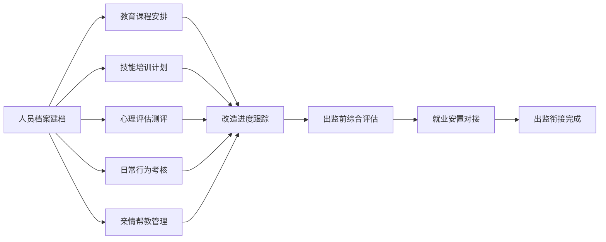

## 1. 产品概述

监狱服刑人员教育改造Web系统是面向管教干警的综合性教育改造管理平台，旨在通过信息化手段提升服刑人员思想教育、技能培训和心理矫治工作的效率与质量。系统涵盖人员档案管理、教育课程安排、技能培训跟踪、心理评估干预、行为考核记录、亲情帮教管理和出监衔接服务七大核心模块，实现服刑人员改造全周期的数字化管理。

## 2. 核心功能

### 2.1 用户角色

| 角色 | 登录方式 | 核心权限 |
|------|----------|----------|
| 管教干警 | 账号密码登录 | 管理服刑人员档案、课程安排、技能培训、心理评估、行为考核、亲情帮教、出监衔接全流程操作 |

### 2.2 功能模块

1. **人员档案页**：服刑人员基本信息管理、档案查询与统计
2. **教育课程页**：思想教育课程安排、文化扫盲、课时记录管理
3. **技能培训页**：职业技能培训计划、培训进度跟踪、技能考核
4. **心理评估页**：心理健康测评、危机干预记录、心理咨询档案
5. **行为考核页**：日常行为打分、违规处理记录、奖惩管理
6. **亲情帮教页**：亲情会见安排、远程视频帮教、家属沟通记录
7. **出监衔接页**：出监前评估、就业安置对接、社会适应性辅导

### 2.3 页面详情

| 页面名称 | 模块名称 | 功能描述 |
|----------|----------|----------|
| 人员档案 | 基本信息卡片 | 展示服刑人员姓名、编号、罪名、刑期、入监时间等核心信息 |
| 人员档案 | 档案列表 | 支持按姓名、编号、监区等条件筛选和搜索 |
| 人员档案 | 统计概览 | 在押人数、刑期分布、改造进度等关键数据统计 |
| 教育课程 | 课程管理 | 思想教育、文化扫盲课程的新增、编辑、删除 |
| 教育课程 | 课时记录 | 记录服刑人员参加课程的时长、考勤、成绩 |
| 教育课程 | 课程排期 | 按周/月展示课程安排日历视图 |
| 技能培训 | 培训项目 | 职业技能培训项目列表，包含培训内容、时长、证书信息 |
| 技能培训 | 培训进度 | 跟踪每位服刑人员的培训完成情况和技能等级 |
| 技能培训 | 考核记录 | 技能考核成绩、补考记录、证书颁发管理 |
| 心理评估 | 测评量表 | 心理健康测评问卷列表和测评记录 |
| 心理评估 | 危机干预 | 心理危机事件记录、干预措施、跟踪随访 |
| 心理评估 | 咨询档案 | 心理咨询会话记录、心理状态评估报告 |
| 行为考核 | 日常打分 | 每日行为表现评分，包含遵规守纪、劳动表现、学习态度等维度 |
| 行为考核 | 违规处理 | 违规事件登记、处罚措施、申诉处理 |
| 行为考核 | 奖惩记录 | 奖励和惩罚的历史记录与统计 |
| 亲情帮教 | 会见管理 | 亲情会见预约、安排、签到记录 |
| 亲情帮教 | 视频帮教 | 远程视频帮教预约、视频记录、时长统计 |
| 亲情帮教 | 家属沟通 | 家属来信、通话记录、帮教建议 |
| 出监衔接 | 出监评估 | 出监前综合评估，包括思想、技能、心理、社会适应等维度 |
| 出监衔接 | 就业对接 | 就业岗位推荐、技能匹配、企业对接记录 |
| 出监衔接 | 社会适应 | 社会适应性辅导计划、安置帮教衔接 |

## 3. 核心流程

管教干警登录系统后，通过侧边栏导航进入各功能模块。以服刑人员改造管理为主线，从人员档案建立开始，贯穿教育课程学习、技能培训参与、心理健康评估、日常行为考核、亲情帮教支持，最终到出监前评估和就业安置对接，形成完整的改造管理闭环。

## 4. 用户界面设计

### 4.1 设计风格

- **主色调**：采用深蓝（#1e3a5f）作为主色调，体现庄重、专业、权威的政务系统特质
- **辅助色**：使用警蓝（#3b82f6）作为交互元素颜色，搭配沉稳的深灰（#374151）和暖橙（#f97316）作为强调色
- **按钮风格**：扁平化设计，微圆角（4px），悬停时有轻微阴影和颜色加深效果
- **字体**：使用思源宋体作为标题字体增强庄重感，思源黑体作为正文字体保证可读性
- **布局风格**：左侧固定导航栏 + 顶部状态栏 + 右侧内容区的经典后台管理布局
- **卡片设计**：浅色卡片搭配细边框，卡片之间有适度间距，信息层次分明

### 4.2 页面设计概览

| 页面名称 | 模块名称 | UI元素 |
|----------|----------|--------|
| 人员档案 | 统计概览 | 数据卡片网格、数字动画、图标搭配 |
| 人员档案 | 档案列表 | 表格布局、搜索筛选栏、分页器 |
| 教育课程 | 课程排期 | 日历视图、课程卡片、颜色分类 |
| 教育课程 | 课时记录 | 时间轴布局、进度条、状态标签 |
| 技能培训 | 培训项目 | 卡片网格、进度环、技能标签 |
| 技能培训 | 考核记录 | 成绩表格、证书徽章、柱状图 |
| 心理评估 | 测评量表 | 问卷卡片、进度指示、结果雷达图 |
| 心理评估 | 危机干预 | 紧急标识、时间线、干预状态 |
| 行为考核 | 日常打分 | 评分表单、评分维度雷达图、趋势折线图 |
| 行为考核 | 违规处理 | 违规卡片、处理状态标签、严重程度标识 |
| 亲情帮教 | 会见管理 | 预约日历、会见室状态、签到按钮 |
| 亲情帮教 | 视频帮教 | 视频卡片、预约表单、通话时长统计 |
| 出监衔接 | 出监评估 | 综合评估仪表板、多维度评分、评估报告 |
| 出监衔接 | 就业对接 | 岗位卡片、匹配度标签、企业信息 |

### 4.3 响应式

桌面端优先设计，适配1366px及以上屏幕宽度。侧边栏在小屏幕可折叠，表格支持横向滚动，卡片布局根据屏幕宽度自适应调整列数。

### 4.4 动效设计

- 页面切换时内容区有淡入效果
- 数据卡片加载时有骨架屏动画
- 悬停交互元素有0.2秒过渡动画
- 统计数字变化时有计数动画效果
