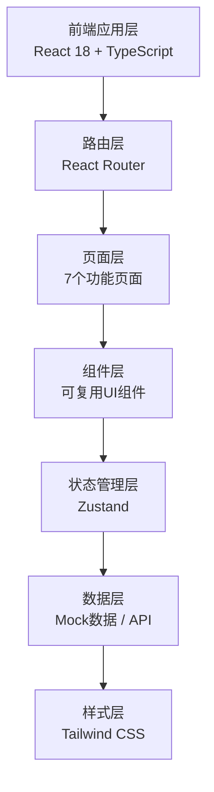

## 1. 架构设计



## 2. 技术描述

- **前端框架**：React 18 + TypeScript
- **构建工具**：Vite 5
- **路由管理**：React Router v6
- **状态管理**：Zustand
- **UI样式**：Tailwind CSS 3
- **图标库**：Lucide React
- **后端**：无后端，使用Mock数据模拟
- **数据存储**：前端本地状态管理

## 3. 路由定义

| 路由 | 页面 | 功能描述 |
|------|------|----------|
| / | 人员档案 | 服刑人员基本信息管理与统计 |
| /education | 教育课程 | 思想教育与文化扫盲课程管理 |
| /training | 技能培训 | 职业技能培训与考核管理 |
| /psychology | 心理评估 | 心理健康测评与危机干预 |
| /behavior | 行为考核 | 日常行为打分与违规处理 |
| /family | 亲情帮教 | 会见管理与视频帮教 |
| /release | 出监衔接 | 出监评估与就业安置对接 |

## 4. 核心数据模型

### 4.1 服刑人员 (Inmate)
```typescript
interface Inmate {
  id: string;
  name: string;
  inmateNumber: string;
  gender: '男' | '女';
  age: number;
  crime: string;
  sentence: string;
  entryDate: string;
  releaseDate: string;
  prisonZone: string;
  educationLevel: string;
  skills: string[];
  status: '在押' | '离监探亲' | '住院';
}
```

### 4.2 课程 (Course)
```typescript
interface Course {
  id: string;
  name: string;
  type: '思想教育' | '文化扫盲' | '普法教育';
  teacher: string;
  totalHours: number;
  schedule: string;
  location: string;
  participants: string[];
}
```

### 4.3 技能培训 (Training)
```typescript
interface Training {
  id: string;
  name: string;
  category: string;
  duration: number;
  level: '初级' | '中级' | '高级';
  certificate: boolean;
  description: string;
  progress: number;
}
```

### 4.4 心理评估 (PsychologicalAssessment)
```typescript
interface PsychologicalAssessment {
  id: string;
  inmateId: string;
  type: '常规测评' | '危机评估';
  date: string;
  score: number;
  level: '正常' | '轻度' | '中度' | '重度';
  counselor: string;
  notes: string;
}
```

### 4.5 行为考核 (BehaviorRecord)
```typescript
interface BehaviorRecord {
  id: string;
  inmateId: string;
  date: string;
  discipline: number;
  labor: number;
  study: number;
  cooperation: number;
  totalScore: number;
  remark: string;
}
```

### 4.6 亲情会见 (FamilyVisit)
```typescript
interface FamilyVisit {
  id: string;
  inmateId: string;
  visitorName: string;
  relationship: string;
  visitType: '现场会见' | '视频会见';
  date: string;
  timeSlot: string;
  status: '待确认' | '已确认' | '已完成' | '已取消';
  duration: number;
}
```

### 4.7 出监评估 (ReleaseAssessment)
```typescript
interface ReleaseAssessment {
  id: string;
  inmateId: string;
  date: string;
  ideologyScore: number;
  skillScore: number;
  psychologyScore: number;
  socialScore: number;
  overallScore: number;
  result: '合格' | '需观察' | '不合格';
  counselor: string;
  suggestions: string;
}
```

## 5. 项目结构

```
src/
├── components/          # 通用组件
│   ├── Layout/         # 布局组件（侧边栏、顶部栏）
│   ├── DataCard/       # 数据卡片组件
│   ├── StatusBadge/    # 状态标签组件
│   ├── ProgressBar/    # 进度条组件
│   └── Table/          # 表格组件
├── pages/              # 页面组件
│   ├── InmateProfile/  # 人员档案页
│   ├── Education/      # 教育课程页
│   ├── Training/       # 技能培训页
│   ├── Psychology/     # 心理评估页
│   ├── Behavior/       # 行为考核页
│   ├── Family/         # 亲情帮教页
│   └── Release/        # 出监衔接页
├── store/              # 状态管理
│   └── useStore.ts
├── data/               # Mock数据
│   └── mockData.ts
├── types/              # TypeScript类型定义
│   └── index.ts
├── utils/              # 工具函数
│   └── helpers.ts
├── App.tsx             # 应用入口
├── main.tsx            # 渲染入口
└── index.css           # 全局样式
```

## 6. 设计系统规范

### 6.1 颜色系统

```css
--primary-900: #1e3a5f;   /* 主色深蓝 */
--primary-700: #2563eb;   /* 主色蓝 */
--primary-500: #3b82f6;   /* 交互色 */
--success-500: #10b981;   /* 成功色 */
--warning-500: #f97316;   /* 警告色 */
--danger-500: #ef4444;    /* 危险色 */
--gray-900: #111827;      /* 深色文本 */
--gray-700: #374151;      /* 次级文本 */
--gray-500: #6b7280;      /* 辅助文本 */
--gray-200: #e5e7eb;      /* 边框色 */
--gray-100: #f3f4f6;      /* 背景色 */
--gray-50: #f9fafb;       /* 浅色背景 */
```

### 6.2 间距系统

基于4px基数：4px, 8px, 12px, 16px, 20px, 24px, 32px, 40px, 48px

### 6.3 字体层级

- 页面标题：20px, 600字重
- 卡片标题：16px, 600字重
- 正文：14px, 400字重
- 辅助文字：12px, 400字重
- 数据大字：28px, 700字重
